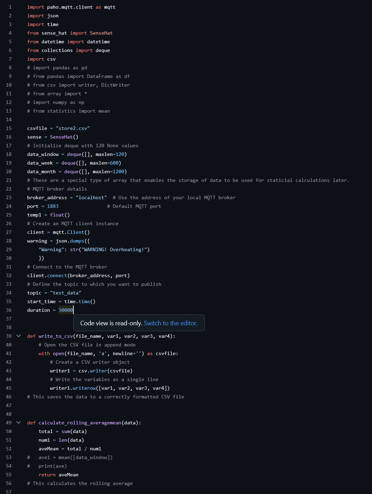

<section>
<a href="https://github.com/cuthbert86/RiverProject"><h2>River Project Screenshots of the Dashboard and python code</h2></a>
</section>
          
<section>
            
  
            
              
             
              
            
              
            
              
            
              
            
              
            
              
            
              
              
              
            
</section>
      
  
        
